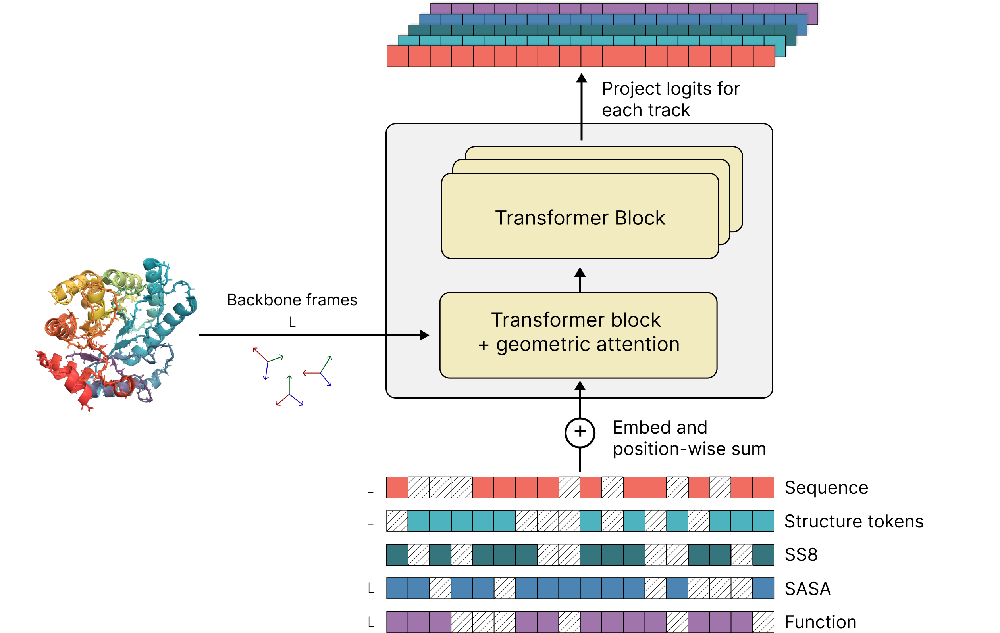

## EvolutionaryScale ESM3 on Amazon SageMaker

This repository contains the sample notebooks to run EvolutionaryScale's ESM3 biological model on Amazon SageMaker.

### What is ESM3
ESM3 is a frontier generative model for biology, able to jointly reason across three fundamental biological properties of proteins: sequence, structure, and function. These three data modalities are represented as tracks of discrete tokens at the input and output of ESM3. You can present the model with a combination of partial inputs across the tracks, and ESM3 will provide output predictions for all the tracks. ESM3 is a generative masked language model. You can prompt it with partial sequence, structure, and function keywords, and iteratively sample masked positions until all positions are unmasked.

The ESM3 architecture is highly scalable due to its transformer backbone and all-to-all reasoning over discrete token sequences. At its largest scale, ESM3 was trained with 1.07e24 FLOPs on 2.78 billion proteins and 771 billion unique tokens, and has 98 billion parameters. Here we present `esm3-open-small`. With 1.4B parameters it is the smallest and fastest model in the family, trained specifically to be open sourced.

### Notebooks in this repository 
* [Deploy ESM3-open Model Package from AWS Marketplace ](esm3-sagemaker-sample-notebook.ipynb)

### About EvolutionaryScale

EvolutionaryScale is a frontier AI research lab and Public Benefit Corporation dedicated to developing artificial intelligence for the life sciences. EvolutionaryScale’s models support groundbreaking research and development in health, environmental science, and beyond. The company was founded in July 2023, with a founding team widely recognized for its pioneering work in transformer protein language models. For more information, visit https://evolutionaryscale.ai

## Security

See [CONTRIBUTING](CONTRIBUTING.md#security-issue-notifications) for more information.

## License

This library is licensed under the MIT-0 License. See the LICENSE file.

